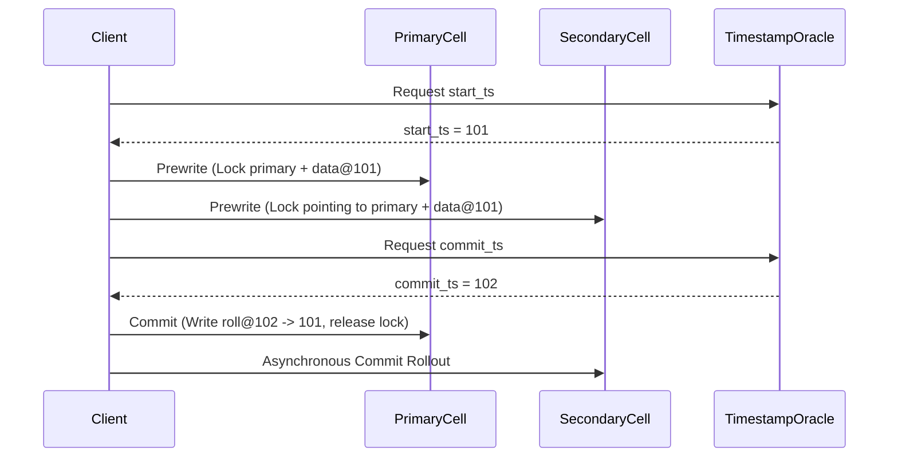

# Percolator Distributed Transaction Protocol Skill

Robust, zero-dependency Python implementation of Google's **Percolator Distributed Transaction Protocol** for snapshot-isolated ACID transactions built over distributed key-value storage.

## Features
- **Primary-Lock 2PC Protocol**: Atomicity anchored around a single designated primary cell lock.
- **Snapshot Isolation (SI)**: Eliminates dirty reads, non-repeatable reads, and phantom reads using monotonic timestamp ordering.
- **Zero External Dependencies**: 100% Python standard library.
- **Native MCP Protocol**: JSON-RPC 2.0 stdio server compatible with Claude Desktop, Cursor, and Windsurf.

## Architecture

